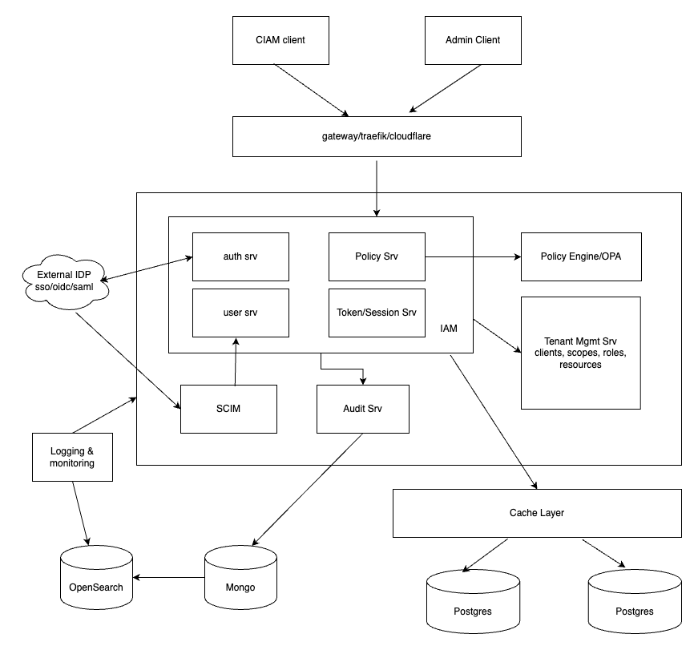
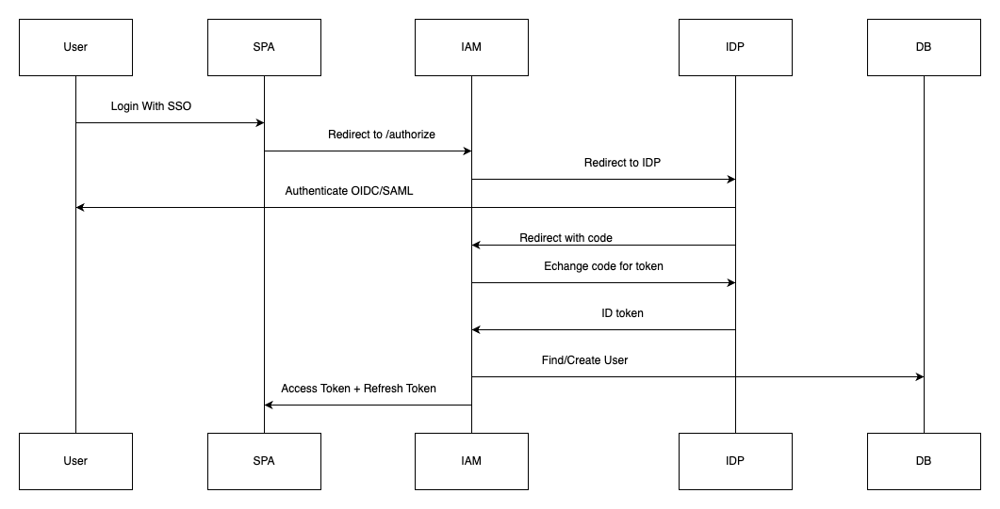
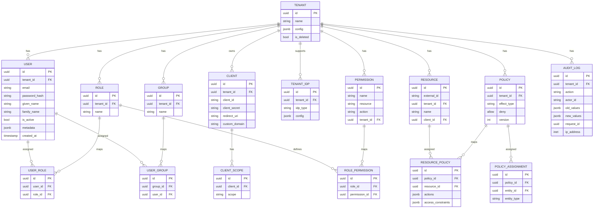
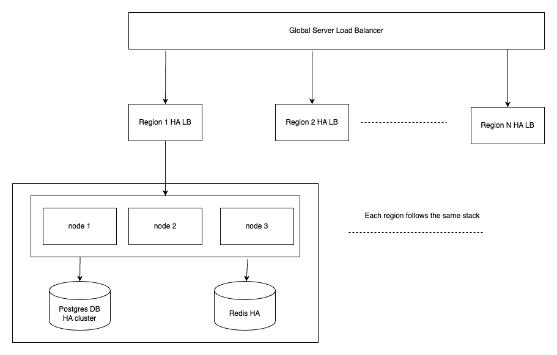

## Customer Identity and Access Management(CIAM) Platform

### Objective

Design a scalable CIAM system for multi tenant SaaS platform:

- Supports SSO
- User lifecycle provisioning (via SCIM)
- FGA
- Capable of serving enterprise customers
- Custom domains for tenants
- External IDP support(basically SSO)
- Scales to support millions of users across thousands of tenants.

### General

This document outlines the components, flows and high-level design of a Management (CIAM) platform. The diagram below shows the core components of the CIAM platform along with their dependent services.



Components:

- **Auth Service**(combindes the identity and authz functionality)
- **Token/Session Service**
- **User Service**
- **Policy Service**
- **Policy Evaluation Engine**
- **Tenant Config Manager Service**
- **SCIM Service**
- **Audit Log Service**
- **Admin UI**

### API Design and Routing (Authentication, User Management, Policy Evaluation)

#### Auth Service

```go
POST /auth-srv/login              // Local login (email/password)
GET  /auth-srv/authorize          // Initiate OAuth2/OIDC login (SSO)
POST /auth-srv/logout             // Revoke tokens / sessions
POST /auth-srv/register           // User self registration
GET  /auth-srv/userinfo           // Get authenticated user info
```

#### Token/Session Service

```go
POST /token-srv/token             // Token exchange (code, refresh_token)
POST /token-srv/introspect        // Token introspection endpoint
POST /token-srv/revoke            // Revoke tokens/sessions
```

#### User Management

```go
GET    /users/:id             // Get user profile
POST   /users                 // Create user
PATCH  /users/:id             // Update user
DELETE /users/:id             // Delete user
```

#### Policy Service

```go
POST    /policy-srv/evaluate  // evaluate access to a resource

GET     /policy-srv/policies
POST    /policy-srv/policies
GET     /policy-srv/policies/:id
PUT     /policy-srv/policies/:id
DELETE  /policy-srv/policies/:id

GET     /policy-srv/roles
POST    /policy-srv/roles
GET     /policy-srv/roles/:id
PUT     /policy-srv/roles/:id
DELETE  /policy-srv/roles/:id
```

#### SCIM Service

```go
GET     /scim-srv/Users
POST    /scim-srv/Users
GET     /scim-srv/Users/:id
PUT     /scim-srv/Users/:id
PATCH     /scim-srv/Users/:id
DELETE  /scim-srv/Users/:id

GET     /scim-srv/Groups
POST    /scim-srv/Groups
GET     /scim-srv/Groups/:id
PUT     /scim-srv/Groups/:id
PATCH   /scim-srv/Groups
DELETE  /scim-srv/Groups/:id
```

### Token Issuance & Validation

- Access Token (JWT): Short-lived, used to access protected resources.
- Refresh Token (opaque): Long-lived, stored in DB. Exchanged for new access token

#### Issuing JWTs (Go pseudocode):

```go
import "github.com/golang-jwt/jwt/v5"

func generateJWT(userID, tenantID string) (string, error) {
    token := jwt.NewWithClaims(jwt.SigningMethodRS256, jwt.MapClaims{
        "sub": userID,
        "tenant_id": tenantID,
        "exp": time.Now().Add(15 * time.Minute).Unix(),
        "iss": "https://iam.example.com",
        "aud": "client_id_abc"
    })
    return token.SignedString(privateKey)
}
```

#### Validating JWTs

- Use `kid` to fetch public key from `/.well-known/jwks.json`
- Validate `exp`, `iss`, `aud` locally

```go
func validateJWT(tokenString string) (*jwt.Token, error) {
    keyFunc := func(token *jwt.Token) (interface{}, error) {
        // Check signing method
        if _, ok := token.Method.(*jwt.SigningMethodRSA); !ok {
            return nil, fmt.Errorf("unexpected signing method: %v", token.Header["alg"])
        }
        // Extract the kid from token header
        kid, ok := token.Header["kid"].(string)
        if !ok {
            return nil, fmt.Errorf("kid header not found")
        }
        // Fetch the public key by kid from JWKS cache or remote endpoint
        publicKey, err := fetchPublicKeyByKid(kid)
        if err != nil {
            return nil, err
        }
        return publicKey, nil
    }

    token, err := jwt.Parse(tokenString, keyFunc)
    if err != nil {
        return nil, err
    }

    // Validate claims after parsing
    if claims, ok := token.Claims.(jwt.MapClaims); ok && token.Valid {
        // Validate exp, iss, aud, nbf, etc.
        if !claims.VerifyExpiresAt(time.Now().Unix(), true) {
            return nil, fmt.Errorf("token expired")
        }
        if !claims.VerifyIssuer("https://iam.example.com", true) {
            return nil, fmt.Errorf("invalid issuer")
        }
        if !claims.VerifyAudience("client_id_abc", true) {
            return nil, fmt.Errorf("invalid audience")
        }
        // Additional custom claim checks if needed
        return token, nil
    }
    return nil, fmt.Errorf("invalid token")
}
```

#### Token revocation

- Revoke token by deleting session and updating cache if jti is set in Redis

### Frontend/SSO Flow

- SPA initiates login and redirects user to:

  ```
  GET /authorize?
      response_type=code
      client_id=spa-app
      redirect_uri=https://iam.com/callback
      scope=openid email profile
      code_challenge=code_challenge_string
      code_challenge_method=S256
  ```

- AM detects login request

  - If local login shows login ui
  - If external IdP (OIDC/SAML) Redirects to external IdP

**OIDC External IdP**

- IAM redirects(OIDC External IdP):

  ```
  https://accounts.google.com/o/oauth2/auth?
      client_id=test
      scope=openid email
      redirect_uri=https://iam.com/callback
  ```

- After login, IdP calls IAM `/callback` with `code`

- IAM exchanges `code` and gets `id_token`, `access_token`

- IAM creates a **local user record** if needed

- IAM issues its own JWT (access token) and optional refresh token

**SAML External IdP**

- IAM sends Authentication Request
- IdP calls IAM with SAMLResponse (POST to Assertion Consumer Service)
- IAM validates the assertion
- IAM issues tokens as above

### Tokens and Session Management

After successfully exchanged code between client and the authz server the authz server issues token as shown below

```json
{
  "access_token": "JWT",
  "refresh_token": "opaque",
  "id_token": "JWT"
}
```

- Access Token sent with every API call: `Authorization: Bearer <access_token>`
- SPA calls `/token` (with refresh token) to get new access token when expired

#### Sequence Diagram



#### Database Schema Design



#### Recommendation between SQL, NoSQL, or a hybrid model

- Use **PostgreSQL** for main structured and relational data like user, tenant, roles etc
- Use **MongoDB/OpenSearch** for:

  - Large audit logs
  - Dynamic SCIM fields
  - App logs(not mongo)

#### Schema Evolution & GDPR Deletion

- Use **[golang-migrate](https://github.com/golang-migrate/migrate)** to migrate schema
- **Soft delete** rows with column `is_deleted` for most use cases.
- For true deletion delete personal data from:

  - `user` table
  - SCIM sync logs
  - token/session tables

#### Stateless Authentication Components (JWT, Caching)

- Validated the JWT's signature using a public key
- Cache Public Key/JWKS instead of calling jwks endpoint frequently
- Cache revoked token IDs
- Cache user permissions or roles associated with the token to avoid repetitive database calls
- Cache refresh token

#### Load Balancing & Horizontal Scaling

- Use **Traefik**, **Nginx** or **Managed load balancers** (like AWS ALB)
- Add **health checks** to detect crashed nodes

#### Multi-region Support

Multi-region is critical for:

- **Low latency request response** from global users
- **Data residency** compliance like GDPR

Use **Global Server Load Balancer** to route traffic to the nearest available region for latency and high availability.

##### Storage Strategy

- Each region hosts its own PostgreSQL and Redis cluster shared by all nodes within that region.
- For region-sensitive tenants, apply tenant-level sharding — e.g. Tenant A’s data resides in `eu-west-1` while Tenant B’s data is isolated in `ap-south-1`.

#### Scale architecture



#### Custom domains for tenants

- The tenant creates a CNAME record in their DNS provider
- Tenant register the custom domain in the admin ui
- IAM platform updates regional LBs with the ssl cert of the domain and configure routing

#### Auditing

- All IAM related events should be logged in the audit log collection.
- The logs can be stored in OpenSearch with Lifecycle Management with hot warm cold policy.

#### Security Event Logging

- Add logs for:

  - Failed logins
  - Consent changes
  - MFA challenges
  - SCIM operations (create/update/delete)

#### Preventing SSO Replay Attacks

- Use PKCE flow
- Use short lived token
- Add `nonce` and `state` parameters to prevent replay and CSRF-style attacks.

#### Handling SCIM Abuse

- Apply Rate Limit in SCIM APIs per-tenant limits.

#### Rate Limiting

- Implement rate limiting at the API Gateway/reverse proxy/service layer with :

  - Per IP
  - Per user
  - Per tenant
  - Per token

#### DDoS Protection

- Use Cloudflare
- Apply IP blocking/Geo-fencing.

#### Secure Tenant Isolation

- **Authorization boundaries**: Enforce `tenant_id` in access tokens and validate it during resource access checks.
- **Database row-level isolation**: Ensure `tenant_id` is included in all `WHERE` clauses to prevent cross-tenant data leakage.
- **Dedicated databases for sensitive tenants**: Use separate databases for tenants with strict data residency or compliance requirements.

#### Open-source Components Suggestiong

- **Keycloak** can be reference for building a CIAM system
- **OPA**: Policy engine to evaluate access control without the need for complex authorization logic in application code

#### Support for Delegated Administration(e.g. tenant admin vs global admin access)

Dogfooding own IAM system by using RBAC with roles like **Global Admin** and **Tenant Admin**
